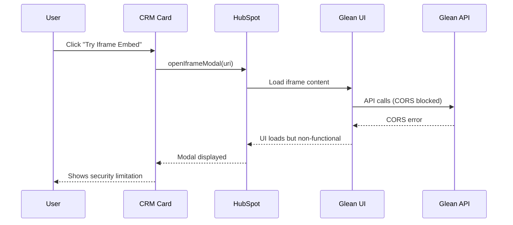
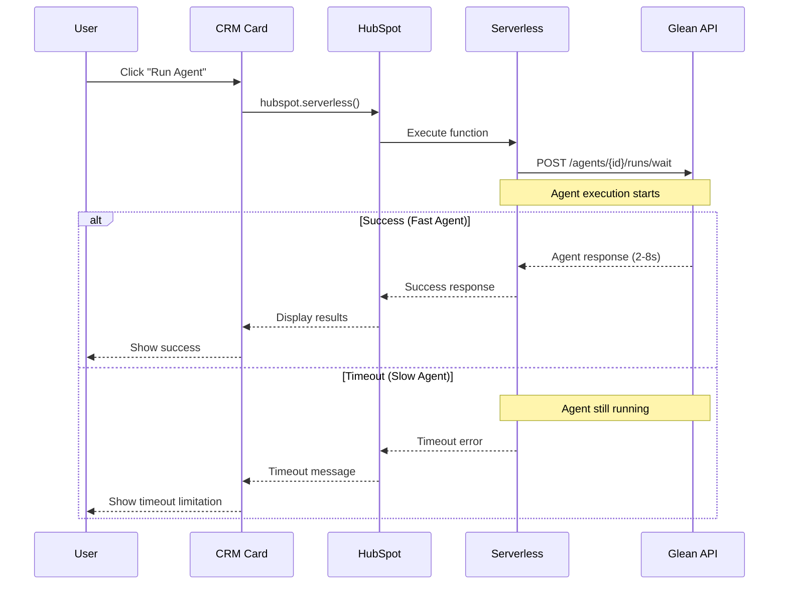
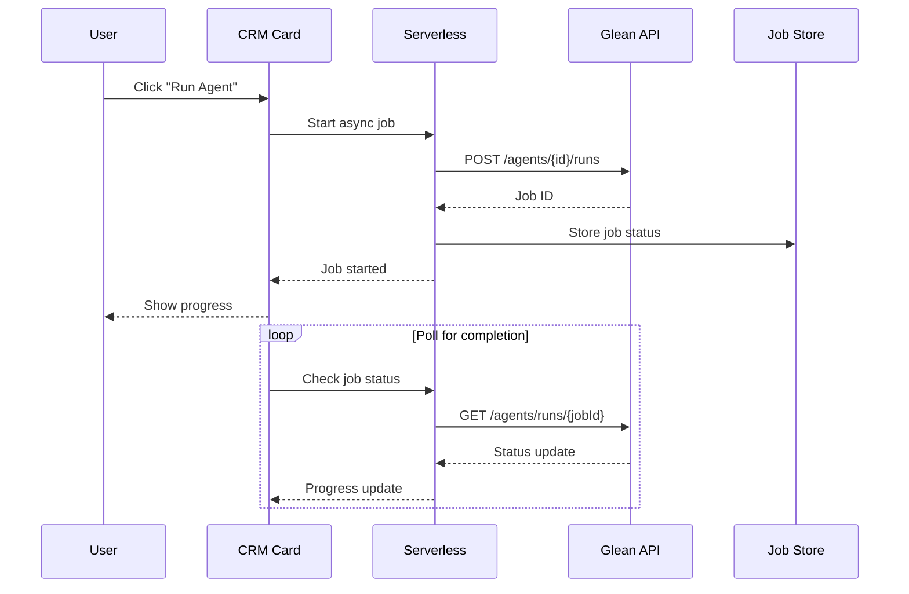
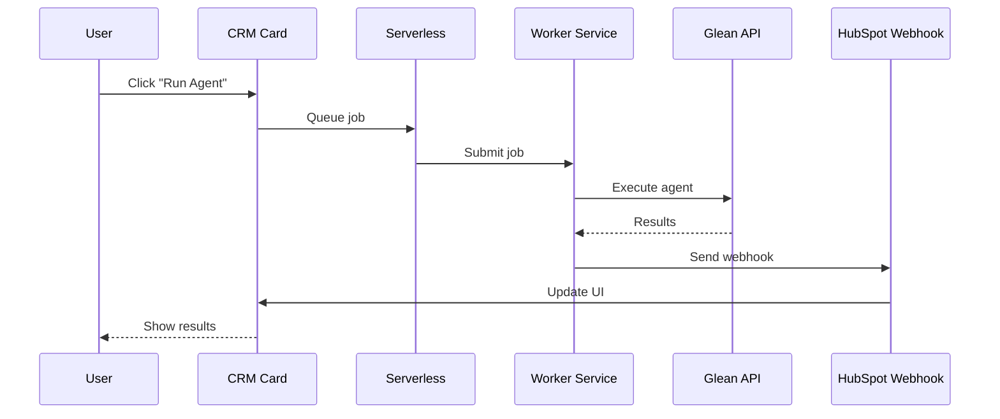

# Architecture Documentation

## Overview

This document describes the technical architecture of the Glean Agent Extension for HubSpot, including both the iframe prototype and serverless CRM card approaches.

## 🏗️ System Architecture

### High-Level Components

```
┌─────────────────┐    ┌─────────────────┐    ┌─────────────────┐
│   HubSpot CRM   │    │  UI Extension   │    │   Glean API     │
│                 │    │                 │    │                 │
│ ┌─────────────┐ │    │ ┌─────────────┐ │    │ ┌─────────────┐ │
│ │ Company     │ │    │ │ CRM Card    │ │    │ │ Agent       │ │
│ │ Record      │ │    │ │ Component   │ │    │ │ Execution   │ │
│ └─────────────┘ │    │ └─────────────┘ │    │ └─────────────┘ │
└─────────────────┘    └─────────────────┘    └─────────────────┘
         │                       │                       │
         │                       │                       │
         └───────────────────────┼───────────────────────┘
                                 │
                    ┌─────────────────┐
                    │ Serverless      │
                    │ Function        │
                    │ (Proxy)         │
                    └─────────────────┘
```

## 🔄 Sequence Diagrams

### Iframe Approach (Prototype)



**Key Points:**
- Iframe loads Glean UI successfully
- Internal API calls to `apps-be.glean.com` are blocked by CORS
- X-Frame-Options: DENY prevents iframe embedding
- Demonstrates security limitations of iframe approach

### Serverless Approach (Working)



**Key Points:**
- Serverless function successfully calls Glean API
- Works for agents that complete within HubSpot's timeout limit
- Demonstrates viable path for programmatic integration
- Shows timeout limitation for long-running agents

## 🔧 Technical Implementation

### Iframe Prototype Components

#### CRM Card (`GleanCard.jsx`)
```javascript
// Key functionality
const openGleanAgentIframe = async () => {
  await actions.openIframeModal({
    uri: 'https://app.glean.com/agents/{agentId}',
    title: `Strategic Account Plan - ${companyName}`,
    width: 1000,
    height: 800,
    flush: true
  });
};
```

**Security Limitations:**
- X-Frame-Options: DENY header blocks iframe embedding
- CORS policy blocks internal API calls
- Content Security Policy restrictions

### Serverless CRM Card Components

#### Serverless Function (`glean-proxy.js`)
```javascript
// Key functionality
const executeGleanAgent = async (companyName) => {
  const result = await glean.client.agents.run({
    agentId: CONFIG.GLEAN_AGENT_ID,
    input: { "Company Name": companyName }
  });
  return result;
};
```

**Timeout Handling:**
- HubSpot serverless functions timeout at ~10-15 seconds
- Glean agents typically take 60-90 seconds
- Error categorization for different failure modes

## 🚨 Known Limitations

### Iframe Approach
1. **X-Frame-Options: DENY** - Glean blocks iframe embedding
2. **CORS Policy** - Internal API calls blocked
3. **Content Security Policy** - Additional browser restrictions
4. **Production Impact** - Cannot be used without vendor changes

### Serverless Approach
1. **Timeout Limit** - HubSpot serverless functions timeout at ~10-15 seconds
2. **Agent Duration** - Glean agents typically take 60-90 seconds
3. **Synchronous Only** - Currently uses blocking `/wait` endpoint
4. **No Persistence** - Results not stored between sessions

## 🔮 Future Architecture Options

### Option 1: Async Job Pattern


### Option 2: External Worker Service


## 🔍 Debugging and Monitoring

### Logging Strategy
- **High-signal logs**: Request start/stop, job_id, response status
- **Error categorization**: timeout, upstream_4xx, upstream_5xx, unknown
- **Debug mode**: Controlled by `DEBUG=true` environment variable

### Error Handling
```javascript
// Error categorization
if (error.statusCode === 408 || error.message.includes('timeout')) {
  throw new Error('AGENT_TIMEOUT: Agent execution exceeded HubSpot timeout limits');
}
if (error.statusCode === 401 || error.statusCode === 403) {
  throw new Error('AUTH_ERROR: API token may not have agents scope permissions');
}
```

## 📊 Performance Considerations

### Current Benchmarks
- **Fast agents**: 2-5 seconds (works with serverless)
- **Medium agents**: 5-8 seconds (works with serverless)
- **Slow agents**: 8+ seconds (timeout with serverless)

### Optimization Opportunities
1. **Caching**: Store results for 24 hours
2. **Preloading**: Start analysis on page load
3. **Progressive loading**: Show partial results
4. **Async patterns**: Implement job-based execution

## 🔒 Security Considerations

### Token Management
- **Current**: Environment variables in serverless function
- **Future**: HubSpot secrets management
- **Best Practice**: Rotate tokens regularly

### Data Handling
- **Input**: Company name only
- **Output**: Strategic account plan
- **Storage**: No sensitive data persisted
- **Transmission**: HTTPS only

## 📋 Testing Strategy

### Test Scenarios
1. **Valid token + fast agent**: Success case
2. **Invalid token**: Authentication error
3. **Bad agent ID**: Not found error
4. **Slow agent**: Timeout error
5. **Network issues**: Connection error

### Test Commands
```bash
# Test Glean API directly
node test-glean-api.js "Company Name"

# Test with custom timeout
node test-glean-api.js "Company Name" --timeoutMs=12000

# Test iframe approach
npm run dev:iframe

# Test serverless approach
npm run dev:card
```

## 🎯 Conclusion

The iframe approach demonstrates the security limitations of embedding complex web applications, while the serverless approach shows a viable path for programmatic integration with known timeout constraints. Future development should focus on async patterns to handle long-running agents effectively. 